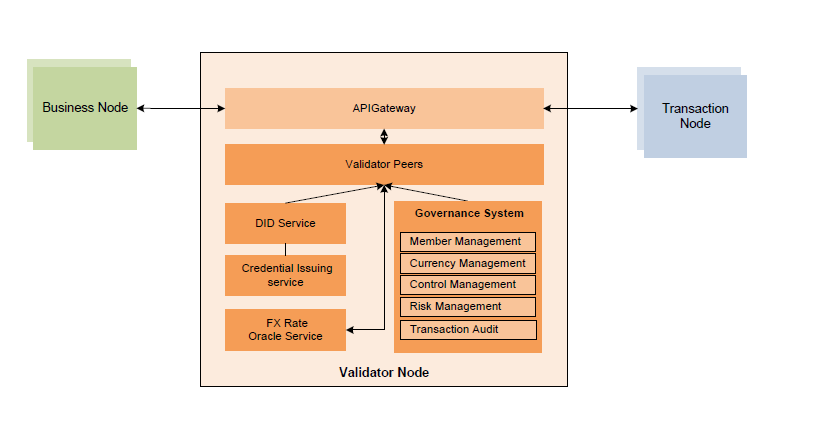

# UDPN VN-Service

----
## What is VN-Service?
The Validator Nodes are at the heart of the UDPN. Any transaction on the UDPN will be validated by a cluster of Validator Nodes which are connected with all the other stakeholders via a secure and encrypted connection. The Validator Nodes and TAR Nodes are the only ones which store the full set of transaction data on the UDPN. Transaction Nodes are owned and operated exclusively by the UDPN Alliance members. 

It must be noted that a Validator Node only validates the format of the message received from a certified Business Node. Upon receipt of a message, the Node validates the veracity of the signature and message origin. It does not however validate the content of the message. The content is only validated by the currency systems, depending on the nature of the transaction.  Each transaction submitted from the Business Nodes will be randomly assigned to certain Validator Nodes to validate. All transactions are validated and written to the peer of Validator Node which reads, endorses, and writes transactions to the distributed ledger Blockchain ledger. The Validator Nodes are connected to the Business and Transaction Nodes through secure APIs.

Each Validator Node’s operations are conducted with full autonomy. The UDPN has no controlling entity but is governed by means of a majority voting. All the Validator Node owners will have the right to vote on such topics as network access permissions, the performance of software updates, the approval of new smart contract deployment and adjustments to fee structures. 

All Validator Nodes contain a governance system that ensures adherence to the rules of the UDPN. As there will be multiple Validator Nodes in the network, with more being added as the alliance grows, not all Validator Nodes are required to participate in the same transaction.

Validator Nodes should be installed in the members’ own cloud account or on-premises infrastructure. As part of the Validator Node installation, each member will also install the UDPN governance software.      

## Known issues
- 包名使用小驼峰式命名法进行命名

## 项目模块
- comp-api-model:vn项目的公用实体模块。
- comp-common:vn项目的公用方法模块。
- comp-besu:vn项目请求besu模块。
- comp-did:vn项目关于did操作的模块。
- chaingateway：vn项目的网关，对外提供给BN。
- redeureka:vn项目的注册中心。
- vn_control:vn项目关于权限操作的模块，目前包括投票相关操作。
- vn_member:vn项目关于成员节点操作的模块，目前包括节点入网、服务费入网、业务信息入网相关操作。
- vn_did:vn项目关于操作DID Document的模块，目前包括DID验签、上链相关操作。
- vn_base_server:vn项目基础服务模块，目前包括发送邮件服务。
- vn_event:vn项目的事件监听服务，目前包括监听链上交易。
- vn_init:vn项目的初始化模块，目前包括初始化数据库。

## 前置条件
### 1.模块启动顺序
redeureka->chaingateway->vn_init->vn_base_server->(vn_control、vn_member、vn_did、vn_event)

首先启动注册中心提供注册服务；然后启动网关服务；再启动vn_init，初始化数据；再启动vn_base_server获取基础服务；最后启动 vn_control、vn_member、vn_did、vn_event（无顺序）。

## 配置说明

| Configuration item | Description |
| ------------------------- | ------------------------------------- |
| server.port | 服务的端口 |
| vncontrol.ribbon.listOfServers | vn_control实例地址 |
| vnmember.ribbon.listOfServers | vn_member实例地址 |
| vndid.ribbon.listOfServers |vn_did实例地址 |
| vnbaseserver.ribbon.listOfServers |vn_base_server实例地址 |
| besu.ribbon.listOfServers |besu实例地址 |
| besuwebsocket.ribbon.listOfServers |besu的websocket地址 |
| eureka.client.service-url.defaultZone |默认服务注册中心地址 |
| spring.cloud.gateway.httpclient.websocket.max-frame-payload-length |网关中websocket最大传输量 |
| ribbon.eureka.enabled |是否启用eureka |
| spring.shardingsphere.datasource.master.url |主数据库地址 |
| spring.shardingsphere.datasource.master.username |主数据库用户名 |
| spring.shardingsphere.datasource.master.password |主数据库密码 |
| spring.shardingsphere.datasource.slave.url |从数据库地址 |
| spring.shardingsphere.datasource.slave.username |从数据库用户名 |
| spring.shardingsphere.datasource.slave.password |从数据库密码 |
| email.host | 邮件服务器地址 |
| email.user | 邮件服务用户名 |
| email.password  | 邮件服务密码 |
| email.from | 邮件服务发件人 |
| mybatis.mapper-locations | mybatis指定mapper文件位置 |
| mybatis.config-location | mybatis指定配置文件位置 |
| eureka.instance.prefer-ip-address | 注册服务时是否使用IP注册 |
| eureka.client.register-with-eureka | 是否注册 |
| eureka.client.fetch-registry | 是否检索服务 |
| logging.logpath | 日志输出地址 |
| logging.level.root | 日志级别 |
| besu.node.url | besu节点地址 |
| besu.contract.attempts | 连接besu失败后重试次数 |
| besu.contract.sleepDuration | 重试间隔时间 |
| besu.UDPN_BASIC_MEMBER_NODE_LOGIC | 节点管理合约地址 |
| besu.UDPN_BIZ_MEMBER_NODE_LOGIC | 节点业务管理合约地址 |
| besu.UDPN_BALLOT_BASIC_MEMBER_NODE_LOGIC | 节点信息投票合约地址 |
| besu.UDPN_BALLOT_BIZ_MEMBER_NODE_LOGIC | 节点业务信息投票合约地址 |
| besu.BALLOT_STRATEGY | 投票策略合约地址 |
| besu.UDPN_PAYMENT_TRANS_LOGIC | 交易合约地址 |
| besu.EXCHANGE_RATE_STRATEGY | 汇率合约地址 |
| besu.UDPN_SERVICE_FEE_LOGIC | 服务费合约地址 |
| besu.UDPN_BALLOT_SERVICE_FEE_LOGIC | 服务费投票合约地址 |
| spring.vn-code | vn的唯一code |
| spring.vn-did | vn的唯一did |
| did.properties.file | DID SDK配置文件地址 |
| spring.rabbitmq.host | rabbitmq地址 |
| spring.rabbitmq.virtual-host | 连接虚拟mq地址 |
| spring.rabbitmq.mgrport | rabbitmq端口 |

## contact us

Email: xxxx@reddatetech.com